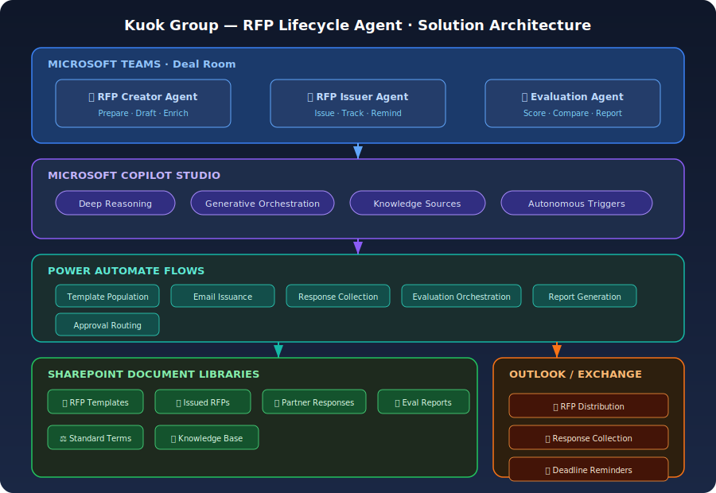

# Kuok Group — RFP Lifecycle Agent

An end-to-end AI Agent solution for **Kuok Group IT** that automates the full RFP lifecycle — from **creation** and **issuance** to **evaluation** and **reporting** — built on Microsoft Copilot Studio, Power Platform, SharePoint, and Microsoft Teams.

> **Built for:** Kuok Group IT Team  
> **Foundation:** [Microsoft Agent for RFP Response Solution Accelerator](https://github.com/microsoft/agent-for-rfp-response-solution-accelerator)  
> **Agent Patterns:** [Awesome Copilot Studio Agents](https://github.com/kesslernity/awesome-copilot-studio-agents)

---

## 🎯 Business Problem

Kuok Group's IT team needs a repeatable, AI-powered solution to:

1. **Prepare RFPs** for 3 engagement types — Turnkey Projects, Managed Services, and Augmented Resources — using standard terms and AI-enriched requirements
2. **Issue RFPs** to invited partners via email
3. **Evaluate RFP responses** against defined guidelines with AI-assisted scoring, background checks, and commercial comparison
4. **Generate final evaluation reports** with team feedback and recommendations for internal approval

---

## 🏗️ Solution Architecture

<p align="center">
  
</p>

---

## 📁 Repository Structure

```
kuok-rfp-agent/
├── README.md
├── agents/
│   ├── rfp-creator/
│   │   ├── instructions.md            # Agent system instructions
│   │   └── topics/                    # ⬅ NEW: Copilot Studio topic YAML
│   │       ├── greeting.yaml
│   │       ├── create-rfp.yaml
│   │       └── fallback.yaml
│   ├── rfp-evaluator/
│   │   ├── instructions.md
│   │   └── topics/
│   │       ├── greeting.yaml
│   │       ├── evaluate-responses.yaml
│   │       ├── generate-report.yaml
│   │       └── fallback.yaml
│   └── rfp-issuer/
│       ├── instructions.md
│       └── topics/
│           ├── greeting.yaml
│           ├── issue-rfp.yaml
│           ├── check-status.yaml
│           └── fallback.yaml
├── templates/
│   ├── turnkey-project/rfp-template.md
│   ├── managed-services/rfp-template.md
│   └── augmented-resources/rfp-template.md
├── knowledge-base/
│   ├── sample-rfps/README.md
│   ├── evaluation-guidelines/evaluation-framework.md
│   └── standard-terms/standard-terms.md
├── flows/
│   ├── flow-definitions.md            # Flow specifications (human-readable)
│   └── power-automate/               # ⬅ NEW: Importable flow JSON
│       ├── README.md                  # Import guide
│       ├── flow-01-rfp-creation.json
│       ├── flow-02-rfp-issuance.json
│       ├── flow-03-response-collection.json
│       ├── flow-04-deadline-reminder.json
│       ├── flow-05-evaluation-report.json
│       └── flow-06-post-deadline-summary.json
├── solution/
│   └── IMPORT-GUIDE.md               # ⬅ NEW: End-to-end import guide
├── deployment/
│   ├── README.md
│   └── images/solution-architecture.svg
├── docs/
│   ├── user-guide.md
│   └── customization-guide.md
├── .gitignore
├── LICENSE
└── CONTRIBUTING.md
```

---

## 🤖 Agents Overview

### 1. RFP Creator Agent
Creates structured, standards-compliant RFPs based on user requirements. Supports three engagement types with AI-enriched requirements that ensure no standard requirements are missed.

**Key Capabilities:**
- Collects project requirements via guided conversation
- Enriches requirements using AI intelligence and verifies with users
- Populates the correct RFP template (Turnkey / Managed Services / Augmented Resources)
- Includes standard terms and conditions per engagement type
- Generates a polished Word document ready for review

### 2. RFP Issuer Agent
Manages the distribution of approved RFPs to invited partners and tracks responses.

**Key Capabilities:**
- Issues RFPs to selected partners via email
- Tracks issuance status and partner acknowledgement
- Collects partner responses and stores in SharePoint
- Sends reminders for approaching deadlines

### 3. RFP Evaluator Agent
Evaluates partner responses against defined criteria using deep reasoning and generates comprehensive evaluation reports.

**Key Capabilities:**
- Extracts and structures data from partner responses
- Scores responses against predefined evaluation criteria
- Performs commercial terms comparison across vendors
- Conducts AI-powered background analysis
- Generates side-by-side comparison matrices
- Produces a final evaluation report with recommendations
- Supports team feedback integration before finalizing

---

## ⚡ Quick Start

### Prerequisites
- Microsoft 365 tenant with Copilot Studio license
- Power Platform environment with System Administrator access
- SharePoint site creation permissions
- Microsoft Teams access
- Outlook access

### Deployment Steps

1. **SharePoint Setup** — Create site and document libraries ([details](deployment/README.md#step-1-sharepoint-setup))
2. **Import Topic YAML** — Paste topic YAML into Copilot Studio agents ([guide](solution/IMPORT-GUIDE.md))
3. **Import Flow JSON** — Import Power Automate flows and configure connections ([guide](flows/power-automate/README.md))
4. **Knowledge Base Setup** — Upload standard terms, templates, and evaluation guidelines ([details](deployment/README.md#step-3-knowledge-base))
5. **Teams Channel** — Set up the Deal Room channel and publish the agents ([details](deployment/README.md#step-5-teams-setup))

### Importable Artifacts (New ✨)

| Artifact | Format | Location | How to Use |
|----------|--------|----------|------------|
| Agent Topics | YAML | `agents/*/topics/*.yaml` | Paste into Copilot Studio Code Editor |
| Power Automate Flows | JSON | `flows/power-automate/*.json` | Import via Power Automate portal or paste into Code View |
| Import Guide | Markdown | `solution/IMPORT-GUIDE.md` | Step-by-step setup instructions |

See the full [Deployment Guide](deployment/README.md) and [Import Guide](solution/IMPORT-GUIDE.md) for detailed instructions.

---

## 🔗 References

| Resource | Link |
|----------|------|
| Microsoft RFP Response Accelerator | [github.com/microsoft/agent-for-rfp-response-solution-accelerator](https://github.com/microsoft/agent-for-rfp-response-solution-accelerator) |
| Awesome Copilot Studio Agents | [github.com/kesslernity/awesome-copilot-studio-agents](https://github.com/kesslernity/awesome-copilot-studio-agents) |
| Copilot Studio Documentation | [learn.microsoft.com/microsoft-copilot-studio](https://learn.microsoft.com/en-us/microsoft-copilot-studio/) |
| Power Automate Documentation | [learn.microsoft.com/power-automate](https://learn.microsoft.com/en-us/power-automate/) |
| Deep Reasoning in Copilot Studio | [YouTube Demo](https://www.youtube.com/watch?v=_v9ri9eoVFg) |

---

## 📄 License

MIT License — see [LICENSE](LICENSE) for details.
